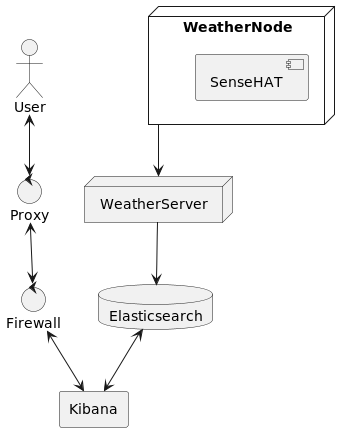
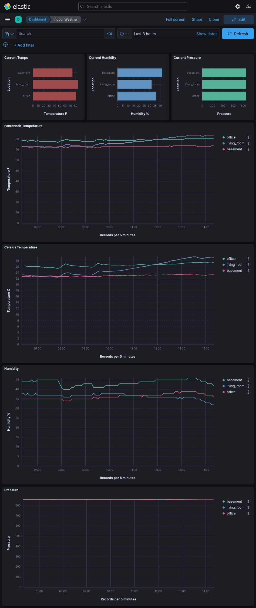

# Indoor Weather Node

This repository supports the Raspberry Pi SenseHat Indoor Weather application

## Overview
This is the Weather Node portion of the Indoor Weather application. This uses a Raspberry Pi and a SenseHAT to read weather data and then send it to the Weather Server for further processing/persistence.

# Setup
## Configuration
You must have three environment variables set:
- **_MASTER_HOST_** - Weather Server host 
- **_MASTER_PORT_** - Weather Server port
- **_WEATHER_LOCATION_** - Weather Node location (i.e. office, kitchen, etc...)

## Installation
Install SenseHat
```
sudo apt install sense-hat
```
Clone repository to device
```
git clone https://github.com/james-cathcart/indoor-weather-node.git
```
Run application
```
python3 main.py
```

## Run as Service
Add the following to `/lib/systemd/system/weather-node.service`. Update the `MASTER_HOST` and `WEATHER_LOCATION` values to reflect your usage.
```
[Unit]
Description=Weather Node for Indoor Weather application

[Service]
Type=simple
Environment="MASTER_HOST=WEATHER_SERVER_HOST"
Environment="MASTER_PORT=8080"
Environment="WEATHER_LOCATION=NODE_LOCATION"

ExecStart=python3 /path/to/main.py

[Install]
WantedBy=multi-user.target
```
### Enable Service on Boot
```
sudo systemctl enable weather-node.service
```

### Start Service
```
sudo systemctl start weather-node.service
```

# Development
## Architecture


## Deployment


# Kibana Dashboard Example
This is an example of the kind of visual representation of the data that may prove interesting.

